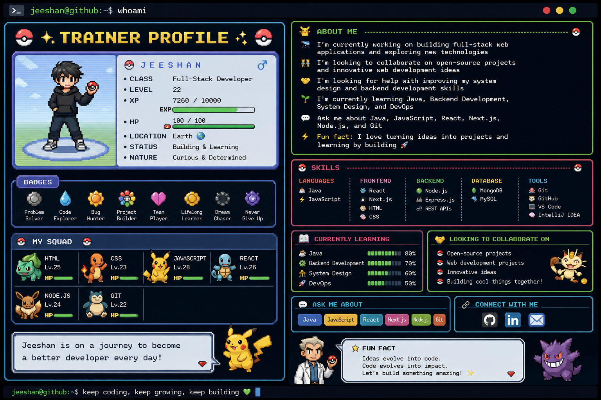

<div align="center">

# ⚡ JEESHAN ⚡

```text
╔══════════════════════════════════════════════════════════════╗
║                                                              ║
║        jeeshan@github:~$ whoami                              ║
║                                                              ║
║        > FULL-STACK DEVELOPER                                ║
║        > ENGINEERING STUDENT                                 ║
║        > BUILDER • PROBLEM SOLVER • LEARNER                 ║
║                                                              ║
║        jeeshan@github:~$ ./start_adventure.sh                ║
║        > Adventure started... 🚀                             ║
║                                                              ║
╚══════════════════════════════════════════════════════════════╝
```

</div>

<div align="center">



</div>

---

# 🎮 TRAINER PROFILE

```text
┌─────────────────────────────────────────────────────────────┐
│                                                             │
│  👤 NAME        : JEESHAN                                   │
│  🎯 CLASS       : FULL-STACK DEVELOPER                      │
│  🧠 SPECIALITY  : BUILDING & LEARNING                       │
│  ⚡ STATUS       : CURRENTLY LEVELING UP                     │
│  🌍 LOCATION    : EARTH                                     │
│                                                             │
└─────────────────────────────────────────────────────────────┘
```

---

# 💻 TERMINAL

```text
┌──(jeeshan㉿github)-[~/developer]
└─$ cat about-me.txt

🔭 CURRENT QUEST
   Building full-stack web applications
   and exploring new technologies.

🌱 CURRENTLY LEARNING
   Java
   Backend Development
   System Design
   DevOps

👯 LOOKING TO COLLABORATE ON
   Open-source projects
   Innovative web development ideas

🤝 LEVELING UP
   Backend development
   System design
   Problem solving

💬 ASK ME ABOUT
   Java • JavaScript • React • Next.js
   Node.js • Git

⚡ FUN FACT
   I love turning ideas into projects
   and learning by building 🚀
```

---

# ⚔️ SKILL TREE

```text
                         ┌──────────────┐
                         │   JEESHAN    │
                         └──────┬───────┘
                                │
            ┌───────────────────┼───────────────────┐
            │                   │                   │
        LANGUAGES            FRONTEND             BACKEND
            │                   │                   │
       ┌────┴────┐         ┌────┴─────┐       ┌────┴─────┐
       │         │         │          │       │          │
      ☕ Java    ⚡ JS     ⚛ React   ▲ Next   🟢 Node   🚂 Express
       │         │         │          │       │          │
       └─────────┴─────────┴──────────┴───────┴──────────┘
                                │
                              TOOLS
                                │
                ┌───────────────┼───────────────┐
                │               │               │
              🐙 Git          🐳 Docker        🎨 Figma
                │               │               │
              GitHub          DevOps          Design
```

---

# 🎒 TECH PARTY

<div align="center">

### ☕ LANGUAGES


### ⚛️ FRONTEND


### 🟢 BACKEND


### 🗄️ DATABASE


### 🛠️ TOOLS & DEPLOYMENT


</div>

---

# 🌱 CURRENTLY LEVELING UP

```text
☕ JAVA
████████████████░░░░  80%

⚙️ BACKEND DEVELOPMENT
██████████████░░░░░░  70%

🏗️ SYSTEM DESIGN
████████████░░░░░░░░  60%

🚀 DEVOPS
██████████░░░░░░░░░░  50%
```

---

# 🏆 QUEST LOG

```text
╔══════════════════════════════════════════════════════════════╗
║                       QUEST LOG                              ║
╠══════════════════════════════════════════════════════════════╣
║                                                              ║
║  [✓] Build full-stack applications                           ║
║  [✓] Learn JavaScript & React                                ║
║  [✓] Work with Node.js & databases                           ║
║  [✓] Learn Git & GitHub                                      ║
║                                                              ║
║  [>] Improve backend architecture                            ║
║  [>] Master system design                                    ║
║  [>] Level up Java                                           ║
║  [>] Explore DevOps                                          ║
║  [>] Contribute to open source                               ║
║                                                              ║
╚══════════════════════════════════════════════════════════════╝
```

---

# 🚀 PROJECT MODE

```text
┌─────────────────────────────────────────────────────────────┐
│                                                             │
│  🎮 BUILD MODE: ON                                          │
│                                                             │
│  I learn by building.                                       │
│                                                             │
│  Every project → New experience                             │
│  Every bug     → New lesson                                 │
│  Every failure → More XP                                    │
│                                                             │
└─────────────────────────────────────────────────────────────┘
```

> 🚧 More projects are being built...

---

# 📊 TRAINER STATS

<div align="center">


<br>


<br>


</div>

---

# 🤝 LOOKING FOR TRAINERS

```text
╔══════════════════════════════════════════════════════════════╗
║                                                              ║
║  👥 OPEN-SOURCE COLLABORATORS                                ║
║  💡 INNOVATIVE PROJECT IDEAS                                 ║
║  💻 DEVELOPERS WHO LOVE BUILDING                             ║
║  🚀 PEOPLE WHO WANT TO LEARN & GROW                          ║
║                                                              ║
╚══════════════════════════════════════════════════════════════╝
```

---

# 🌐 CONNECT

<div align="center">

<a href="https://www.linkedin.com/in/mojeeshan/">

</a>

</div>

---

# ⚡ FINAL MESSAGE

```text
┌──(jeeshan㉿github)-[~]
└─$ ./motivation.sh

> Idea detected...
> Code written...
> Bugs found...
> Bugs fixed...
> Skill unlocked! 🔓

> KEEP CODING.
> KEEP LEARNING.
> KEEP BUILDING. 🚀
```

<div align="center">

### ⭐ Thanks for visiting my profile!

```text
jeeshan@github:~$ echo "The adventure continues..."
The adventure continues... 🚀
```

</div>
